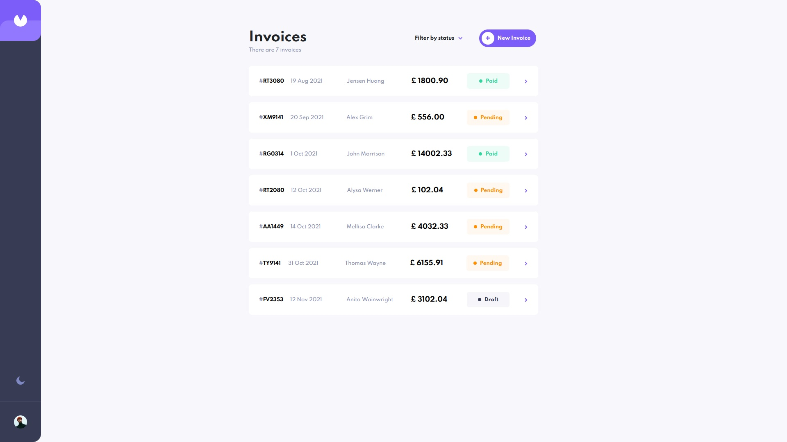
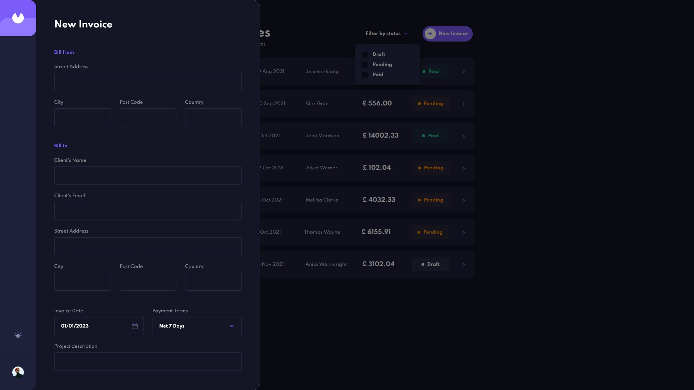
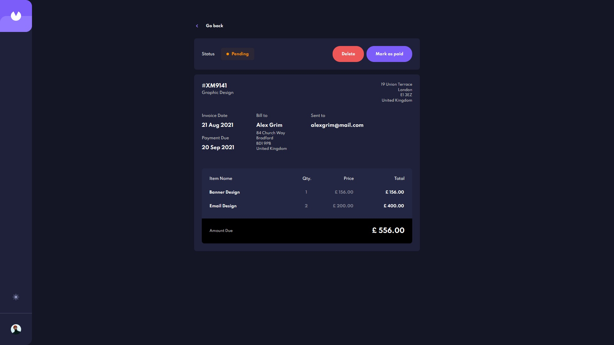

### The challenge

Users should be able to:

- View the optimal layout for the app depending on their device's screen size
- See hover states for all interactive elements on the page
- Create, read, update, and delete invoices
- Receive form validations when trying to create/edit an invoice
- Save draft invoices, and mark pending invoices as paid
- Filter invoices by status (draft/pending/paid)
- Toggle light and dark mode
- Keep track of any changes, even after refreshing the browser 

### Screenshot





### Links

- Live Site URL: [https://vmpetkov90.github.io/invoice-app/]

### Built with

- Semantic HTML5 markup
- CSS3
- Flexbox
- Mobile-first workflow
- JavaScript
- jQuery
- AJAX


### What I learned

Developing this project I had a chance to practice my ability to use AJAX, JSON and localStorage.

```js
function showInvoices(invoices, filter) {

    const month = ['Jan', 'Feb', 'Mar', 'Apr', 'May', 'Jun', 'Jul', 'Aug', 'Sep', 'Oct', 'Nov', 'Dec'];

    let count = 0;

    $(".invoice").remove();
    $(".main-footer").removeClass("show");

    for (let invoice of invoices) {
        if (count === 0) {
            $(".invoices-num p").text(`No invoices`);
        }

        if (filter.includes(invoice.status)) {
            count++;

            if (filter === "pending,draft,paid") {
                $(".invoices-num p").text(`There are ${count} invoices`);
            } else if (count === 1) {
                $(".invoices-num p").text(`There is 1 ${invoice.status} invoice`);
            } else {
                $(".invoices-num p").text(`There are ${count} ${invoice.status} invoices`);
            }

            const date = new Date(invoice.paymentDue);
            const invoiceContainer = $("<div class='invoice'></div>");
            const invoiceNum = $(`<p class="single-invoice-num">#<span>${invoice.id}</span></p>`);
            const name = $(`<p class="name">${invoice.clientName}</p>`);
            const data = $(`<p class="date">${date.getDate()} ${month[date.getMonth()]} ${date.getFullYear()}</p>`);
            const total = $(`<p class="total">£ ${invoice.total.toFixed(2)}</p>`);
            const status = $(`<p class="status status-${invoice.status}">${invoice.status}</p>`);
            const button = $("<button class='open'></button>");

            invoiceContainer.append(invoiceNum, name, data, total, status, button);

            $("main .container").append(invoiceContainer);
        }

    }

}
```

## Author

- Website - [Vasil Petkov](https://www.vasilpetkov.com)
